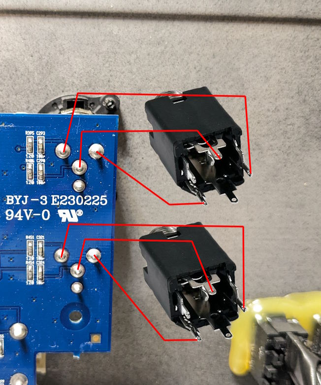
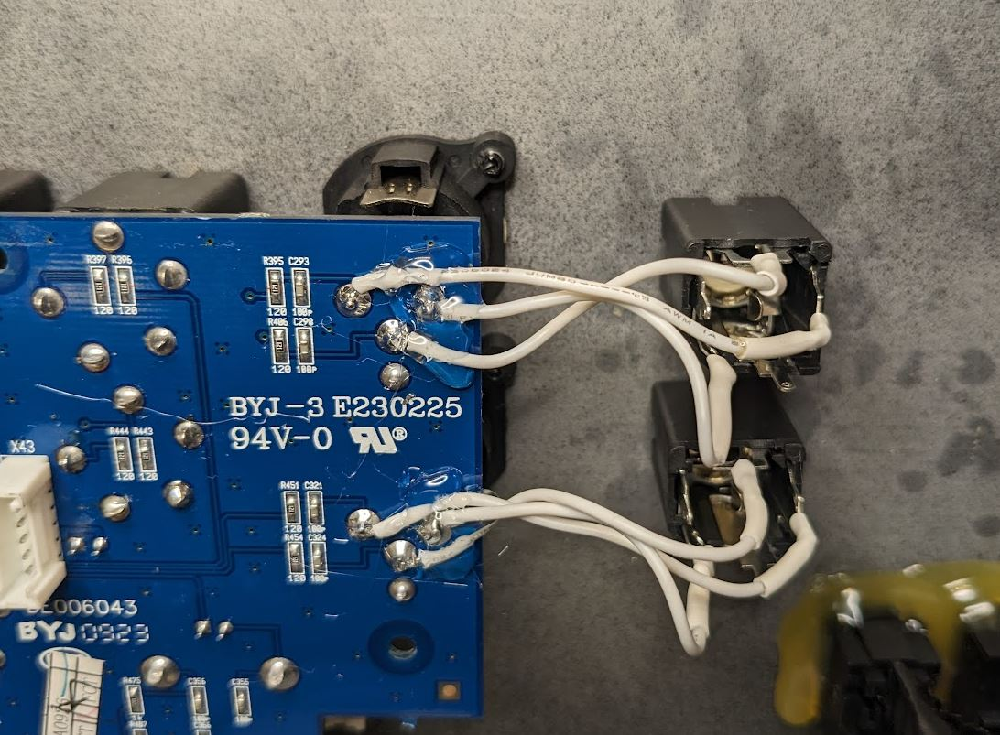
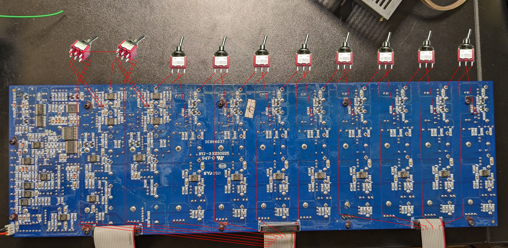
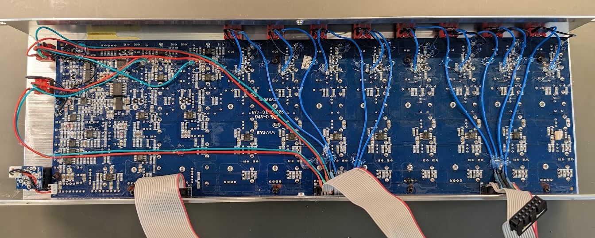
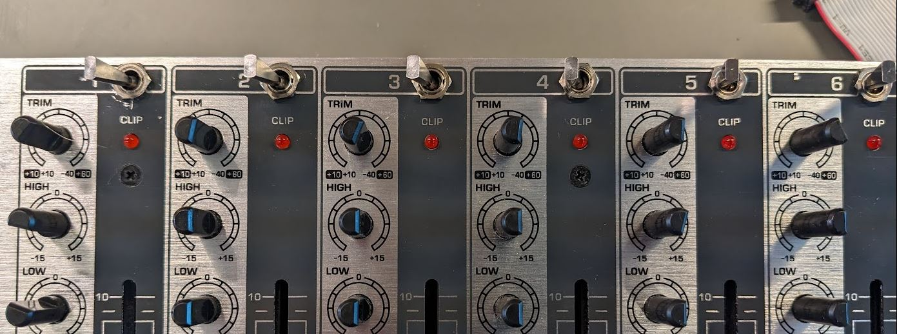

# Behringer RX1202FX Mods

This documents two mods I made to my mixer.

For a video about this, see: https://www.youtube.com/watch?v=38bwDFGXL1Y

## TRS Main Out

The XLR jacks of Main Out can be inconvenient when you would rather have TRS. It's simple to wire in a TRS jack in parallel.

Here's the finished result.

## Channel Mute Switches

There's just enough room above the front PCB to put a SPDT mini toggle, but it needs to be sideways. This means the mute switch will be left for mute and right for unmute. You can wire it the other way around if that makes more sense to you. Remember that toggle switch terminals are inverted -- when the switch is in the left position, it connects the center terminal to the terminal on the right.

The stereo channels need DPDT switches, and there isn't enough room for those above the PCB. Luckily there's plenty of room to the right side of the PCB, above the headphone jack. These can be up for unmute if you prefer, any orientation will do.

For each channel, you will separate one of the wires in the ribbon cable, cut it near the PCB connector, strip the insulation, and splice it to a longer wire. Each of those will go to one throw of a toggle. The other throw will go to signal ground, which can be found in many locations on the board. The common terminal of the switch goes to a pad on the back of the PCB where the signal would usually go. For the mono channels that's a film capacitor. For the stereo channels it's a surface mount resistor.

| Channel | Send | Return |
| --- | --- | --- |
| 1     | X40p3 | C22 bottom |
| 2     | X40p7 | C23 bottom |
| 3     | X40p11 | C24 bottom |
| 4     | X40p14 | C25 bottom |
| 5     | X41p3 | C26 bottom |
| 6     | X41p7 | C27 bottom |
| 7     | X41p10 | C28 bottom |
| 8     | X41p14 | C29 bottom |
| 9(L)  | X41p15 | R116 bottom |
| 10(R) | X41p16 | R115 bottom |
| 11(L) | X41p18 | R120 bottom |
| 12(R) | X41p19 | R119 bottom |

The holes should be positioned as close as possible to the top. This allows the wall of the extrusion to prevent the inner nut from turning. They need to be drilled from the front because the shape of the extrusion interferes coming from the back. The nuts for the toggle switches are 8mm between flats, and the top wall of the extrusion is 1.45mm. So the hole should be 5.45mm from the top of the front panel, measured from the outside. 5.50mm should also be fine. The holes should be 1/4" or 6.35mm.

Here's the finished result.

